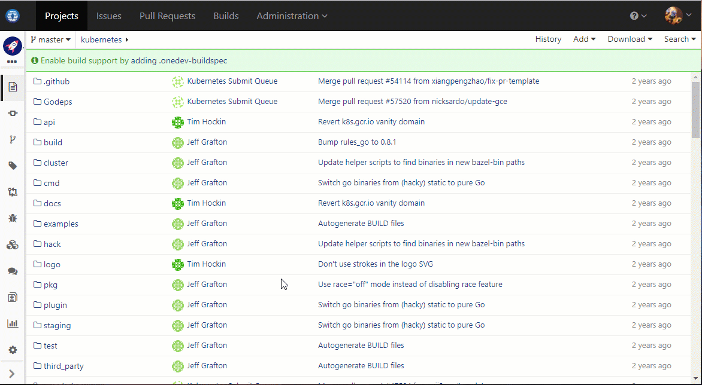
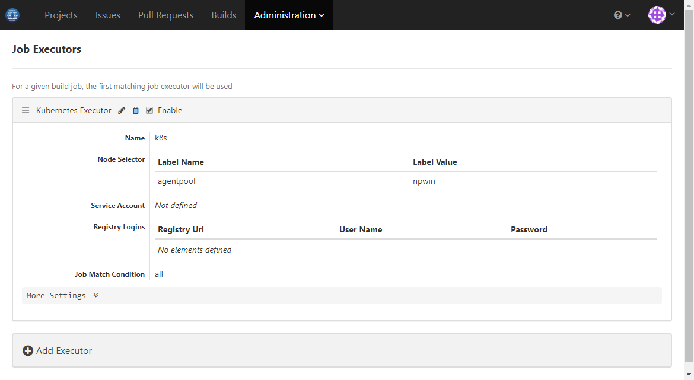
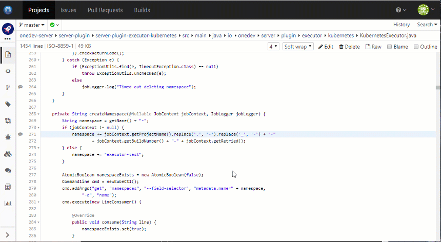
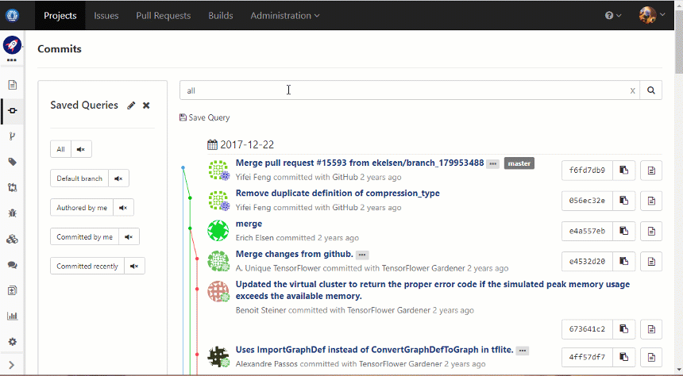

# Super Easy All-In-One DevOps Platform 

With Issue Tracking, Git Management, Pull Request, Wiki, and Build Management. Simple yet Powerful.

| <a href="https://code.onedev.io/projects/onedev-manual/blob/master/pages/5min-tutorial.md">A Five Minutes Tutorial</a> 
| <a href="https://code.onedev.io/projects/onedev-manual/blob/master/pages/installation-guide.md">Installation Guide</a> 
| <a href="https://code.onedev.io/projects/onedev-manual/blob/master/pages/usage-scenarios.md">Usage Scenarios</a>
| <a href="https://code.onedev.io/projects/onedev-manual/blob">All Documentations</a> |

Being open source does not mean that features of OneDev are compromised compared to other commercial products. Instead it has many benefits:

### Symbol Search and Navigation

Language aware symbol search. Symbol navigation in source code and diff. Outline display and search. Works for every commit. Currently supports Java, JavaScript, C, C++, CSharp, Go, PHP, Python, CSS, SCSS, LESS and R. 

### Docker First Kubernetes Native Build Farm

Damn easy to set up a build farm to run massive CI builds as pods in Kubernetes. No agents or runners required. Transparent support for Linux and Windows containers. 

### Super Easy to Create Build Spec

No YAML files to write. No complex grammars to remember. Create build spec for your projects instantly without learning.

### Flexible Build Workflow and Pipeline

Use parameters to control job behaviors. Create matrix builds by combining values of different parameters. Connect jobs to create pipelines via dependencies. Run massive job pods concurrently to speed up processing. Manual approval of certain jobs with role based control.

### Code Discussions and Comprehensions

Instant code discussions on arbitrary block of source code or diff without creating pull requests. Discussions stay with the code to help code comprehension even if file is changed or renamed. This also works for code discussions from pull requests. 

### Commit Query and Subscription

Commit query by file, author, committer, date, or message. Save the query for quick access. Subscribe the query to be notified of interesting changes.

