**NOTE:** We develop OneDev at <a href="https://code.onedev.io/projects/160">code.onedev.io</a> for sake of dogfooding. All issues and pull requests should be submitted there

<h1>Self-hosted Git Server with Built-in CI/CD</h1>

| <a href="https://code.onedev.io/projects/162/blob/main/pages/quickstart.md">5-minute Quickstart</a> 
| <a href="https://code.onedev.io/projects/162/blob/main/pages/installation-guide.md">Installation Guide</a> 
| <a href="https://code.onedev.io/projects/162/blob/main/pages/tutorials.md">Tutorials</a>
| <a href="https://code.onedev.io/projects/162/blob">All Documentations</a> |

## Out-of-box Symbol Search and Navigation

Of course IDE is good at doing this, but often we need to search in old commits (investigate issues in release versions etc), and switching commits in IDE can be troublesome and slow. 

It works by analyzing source code with ANTLR, extracting symbols for storage incrementally, fast and space efficient. Now supports Java, JavaScript, C, C++, CSharp, Go, PHP, Python, CSS, SCSS, LESS and R. GitHub adds this feature several years ago, but seems that it only works for main branch, and GitLab has to configure CI job to generate and upload LSIF which is troublesome and can occupy considerable space if you do it for each commit.

You can also jump to symbol definition in diff while reviewing commits or pull requests.

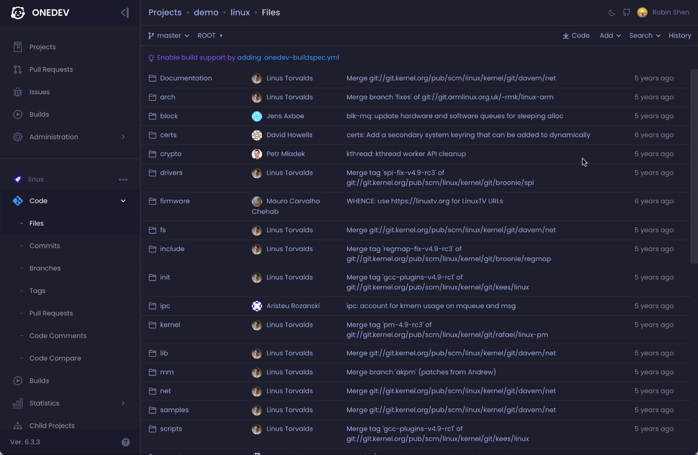

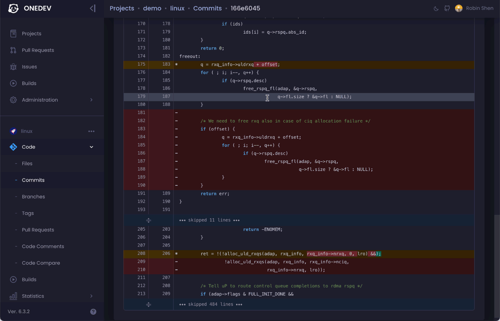

## Code Search with Regular Expression

You may switch to any commit, and search code with regular expression. OneDev under the hood indexes the code with Lucene incrementally. At search time, literal tri-grams in the regular expression are extracted for a coarse search, followed by exact match in the result. This makes the regex search blazing fast, even for large repositories like Linux.

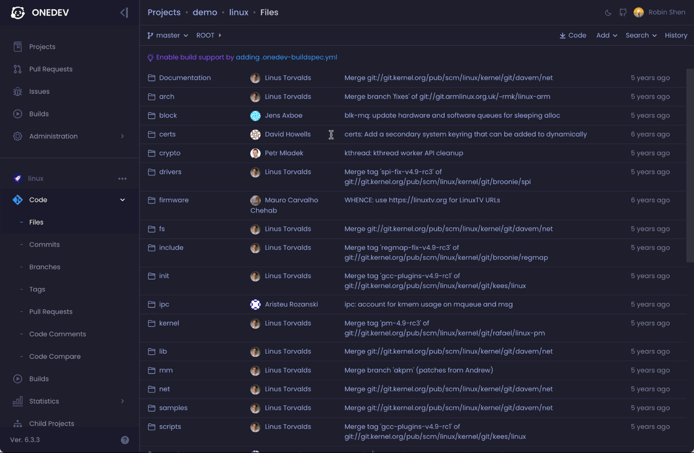

## Annotate Source/Diff with Static Analysis Result to Facilitate Code Review

Of course this can be done by many third party applications at GitHub, however they display the result on their own applications, and this makes review activities such as adding comment over analysis result difficult. Not to mention that you need to pay for these services.

## Customizable Issue State and Field, with Deep CI/CD Integration

The simple open/close state of GitHub/GitLab issues does not work well for many workflows. Considering issues submitted by customers:

1. If developer closes issue upon committing the code, customer will be notified and may ask for the release fixing the issue.
2. If developer closes the issue at release time, QA might be confused at what issues to test as they all remain open at test time. 

With customizable issue states, we may address the issue with four states: open, committed, test ready and released:

1. When code is committed, issue transits to committed state automatically
2. When a test build is created and deployed, the issue transits to test ready state automatically. QA will be notified and can check issue detail to know which environment the test build is deployed into.
3. When test passes, and a release build is created, customers submitting the issue will be notified and they can check issue detail to see which release contains the fix. 

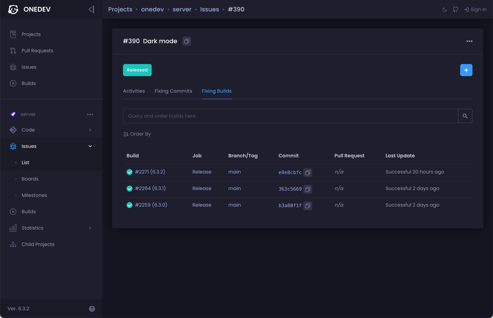

## A powerful and Intuitive Query Language

Thanks to ANTLR again, OneDev ships sophisticated query languages for projects, commits, issues, builds, and pull requests, with intuitive auto-completions and hints. For instance, it enables our customers finding fixed issues between their running release and latest release, and enables us to find all commits submitted by someone touching specified modules, etc. 

Queries can be saved and subscribed, so that you won't miss anything interested.

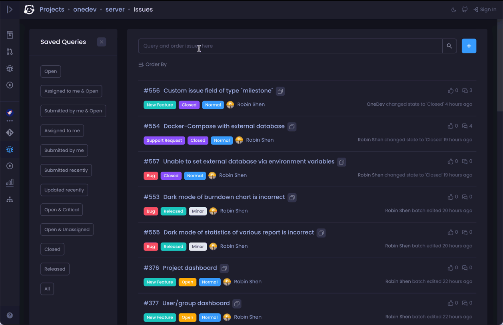

## A Full-fledge CI/CD Engine without Writing Yaml

OneDev ships with GUI to generate CI/CD Yaml. No need to google around for Yaml grammars. A one-liner docker command to start OneDev server and you have a local CI/CD runner automatically. Concerns about server capability to run massive jobs? Another one-liner to connect self-updating agent from any machine. Want auto-scale up/down CI/CD farm? A helm one-liner to deploy OneDev into k8s cluster. 

Matrix jobs, typed parameters, parameter chaining, step templates, build promotions… too many neat features to elaborate here…

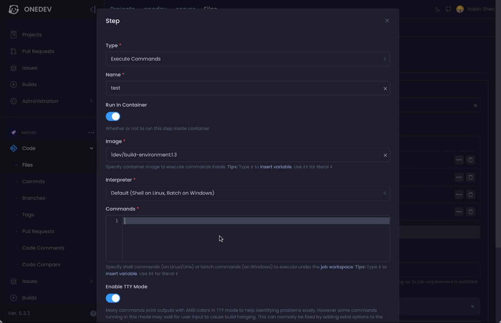

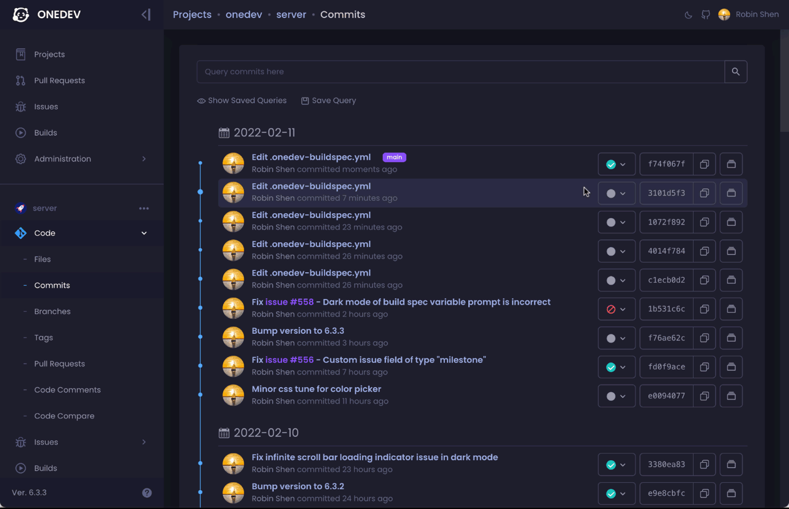

## Flexible Pull Request Review Policy and Reviewer Suggestion

Specify pull request review policy based on author, branch, and changed files. OneDev can leverage git change history to suggest most appropriate reviewers for pull requests touching certain files.

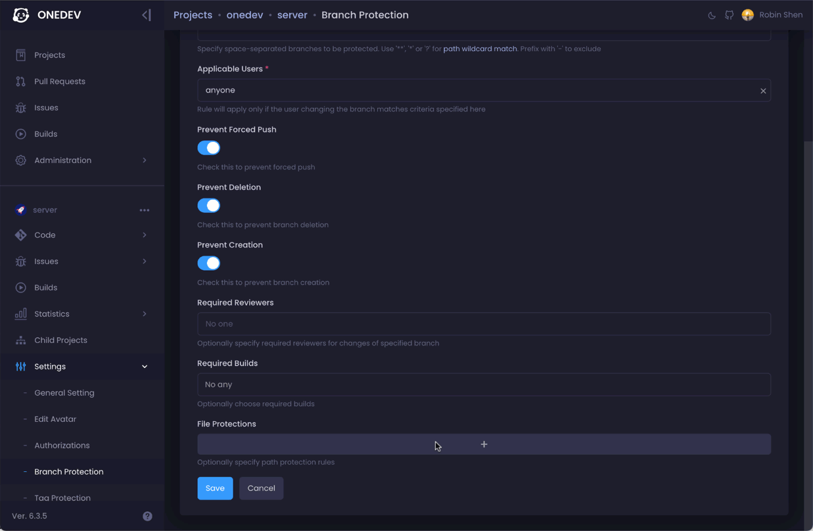

## Lightweight Review without Pull Request

Comment on any part of code or diff to start a lightweight review without opening pull request. Review comments live through code modification and even file rename to serve as documentation. 

Each discussion is threaded so that you can easily know discussions with new comments/updates.

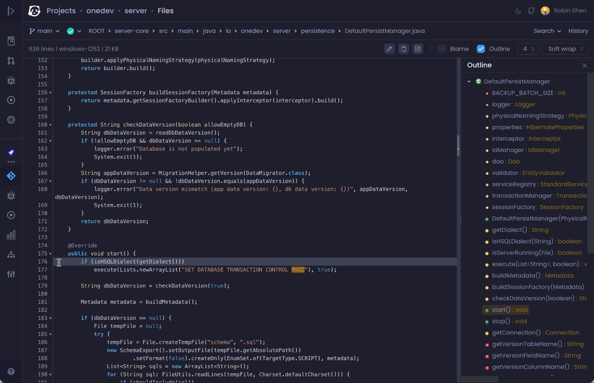

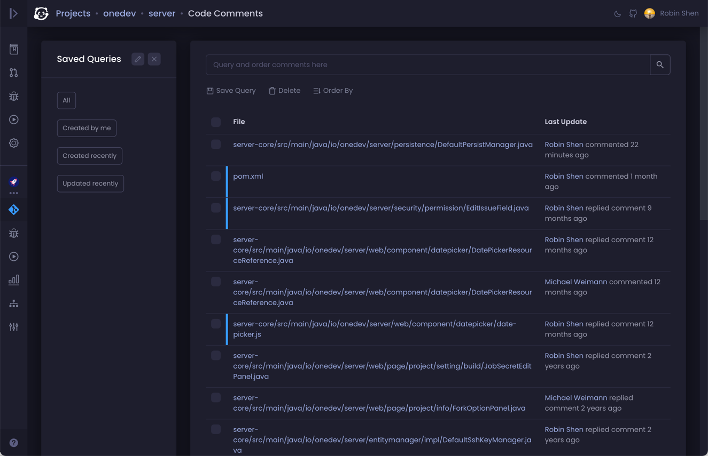

## Write Markdown Pleasantly With a Smart Editor

When embedding an image in a markdown file in GitHub/GitLab, you need to upload the image in a separate page, and then figure out the relative path to reference that image. With OneDev, you simply upload the image to desired folder in same editor, and the link will be generated automatically. 

OneDev tracks your cursor in edit window and scrolls the preview window as necessary so that you can always preview what you are typing.

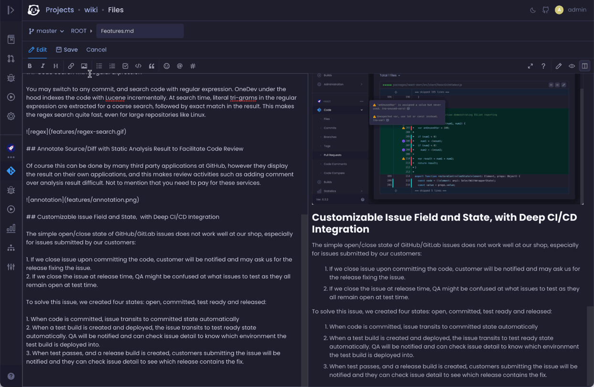

## SLOC History By Language Over Time

## Project Hierarchy to Facilitate Setting Inheritance

Organization is ideal for public service. However for self-hosted internal use, we feel that a hierarchical structure is more practical to organize projects. Child projects can inherit settings from parent project and can selectively override some of them if necessary. This reduces a lot of overhead to manage a lot of projects in the company.

----

# Special Thanks

 

[YourKit](https://yourkit.com) supports this project by providing a free open source license of YourKit Java profiler