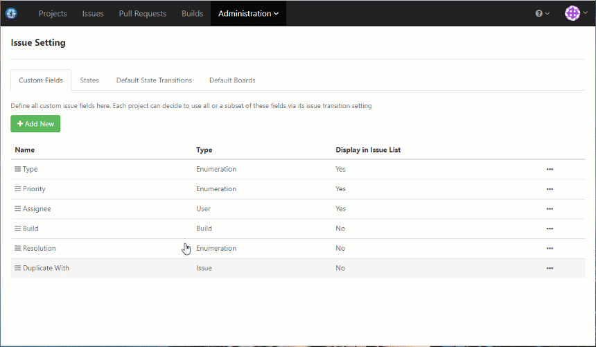
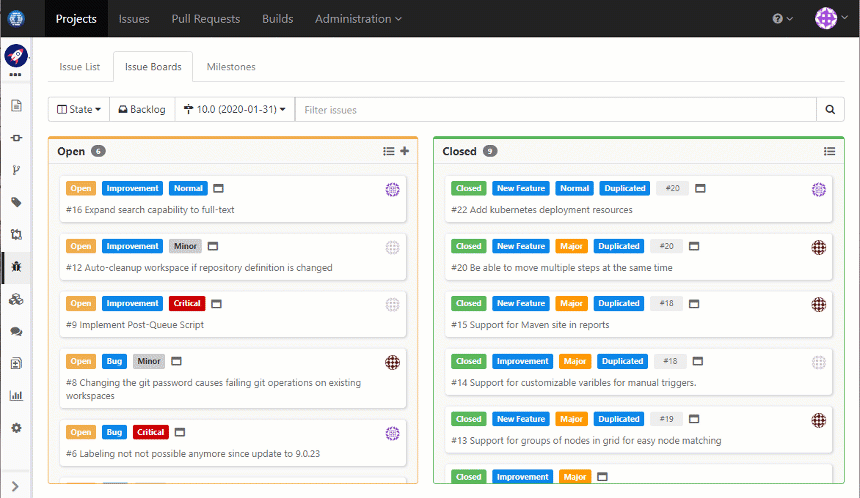
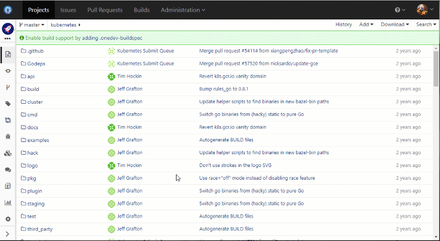
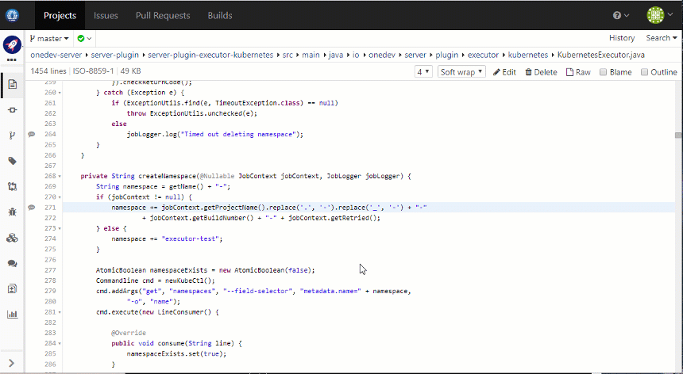
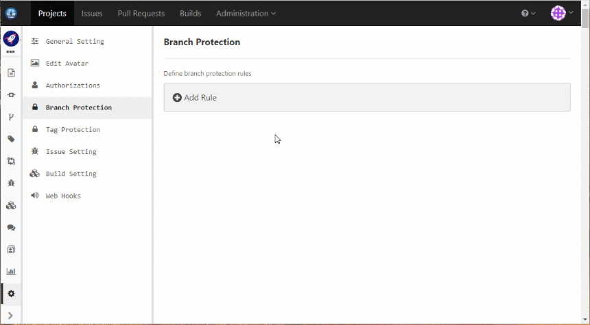
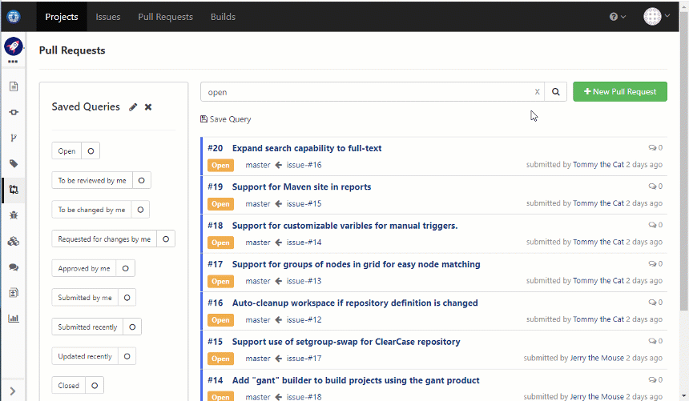
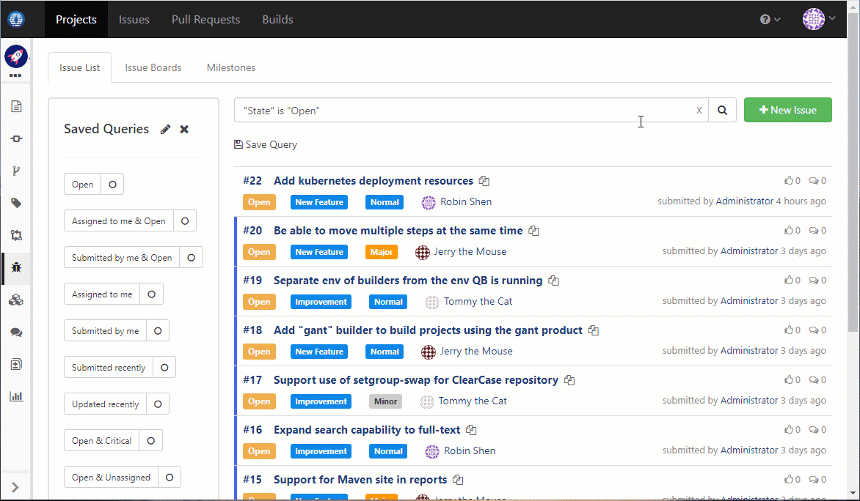

# Super Easy All-In-One DevOps Platform 

With Issue Tracking, Git Management, Pull Request, and Build Farm. Simple yet Powerful.

| <a href="https://code.onedev.io/projects/onedev-manual/blob/master/pages/5min-tutorial.md">A Five Minutes Tutorial</a> 
| <a href="https://code.onedev.io/projects/onedev-manual/blob/master/pages/installation-guide.md">Installation Guide</a> 
| <a href="https://code.onedev.io/projects/onedev-manual/blob/master/pages/usage-scenarios.md">Usage Scenarios</a>
| <a href="https://code.onedev.io/projects/onedev-manual/blob">All Documentations</a> |

Feature highlights compared to other products in the market:

### Docker First Kubernetes Native Build Farm

Damn easy to set up a build farm to run massive CI builds as pods in Kubernetes. No agents or runners required. Transparent support for Linux and Windows containers. 

### Super Easy to Create Build Spec

No YAML files to write. No complex grammars to remember. Create build spec for your projects instantly without learning.

### Flexible Build Workflow and Pipeline

Conditional build parameters. Create matrix builds by combining values of different parameters. Connect jobs to create pipelines via dependencies. Run massive job pods concurrently to speed up processing. Manual approval of certain jobs with role based control.

### Custom Issue States and Fields

Add custom issue states and fields. Appearance or value of issue field can be defined to be dependent on value of other fields. Define manual state transition rules with permission control, or auto transition rules when certain events happen. 

### Auto Refreshing Issue Boards

Define issue boards to show issues in columns based on values of specified field. Perform all operations to issues without leaving the board. Board will be refreshed automatically to reflect most recent issue state.

### Symbol Search and Navigation

Language aware symbol search. Symbol navigation in source code and diff. Outline display and search. Works for every commit. Currently supports Java, JavaScript, C, C++, CSharp, Go, PHP, Python, CSS, SCSS, LESS and R. 

### Code Discussions and Comprehensions

Instant code discussions on arbitrary block of source code or diff without creating pull requests. Discussions stay with the code to help code comprehension even if file is changed or renamed. 

### Flexible Pull Request Review Policies

Enforce pull request review under certain conditions with branch protections. Specify required reviewers and builds for desired file patterns. 

### Iterative Pull Request Review

Code discussions in pull requests are well organized so that user can easily know what has been changed since last review.

### Powerful Query Language

A powerful query language is available to execute sophisticated queries against projects, commits, builds, issues, pull requests or code comments, with auto suggestions and completions everywhere. Query can be saved for quick access later, and can be subscribed to get notified of interesting events.

### Deep Integration of Code, Issue, Pull Request and Build

Configure issue to transit to desired state upon particular commit, build or pull request events. See commit and pull request events in issue activities. Query fixed issues between two builds. Query builds or pull requests fixing specified issues.

### Fine Grained Permission Control

Define permission schemes best suiting your development workflow. For instance, you may specify who can change particular source folder, who can assign issues, who can run release builds, or who can access build log, etc.

