

> **NOTE: ** We develop OneDev at <a href="https://code.onedev.io">code.onedev.io</a> for sake of dogfooding. Please submit issues and pull requests there

<h1>Git Server with CI/CD, Kanban, and Packages</h1>

<h2>
<a href="https://docs.onedev.io">Get Started</a> 
</h2>

## 🔎 Out-of-box code search and navigation

Language aware symbol search and navigation in any commit.
Click symbol to show occurrences in current file.
Fast code search with regular expression. 
[**Try It**](https://code.onedev.io/demo/dotnet-runtime)

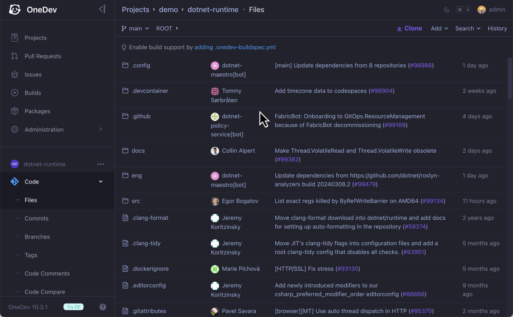

## 📦 Renovate integration to update project dependencies

Integrate with Renovate to update project dependencies via pull requests. 
Merge pull requests automatically when approved by required reviewers, or pass required tests.
[**Tutorial**](https://docs.onedev.io/tutorials/cicd/dependency-update)

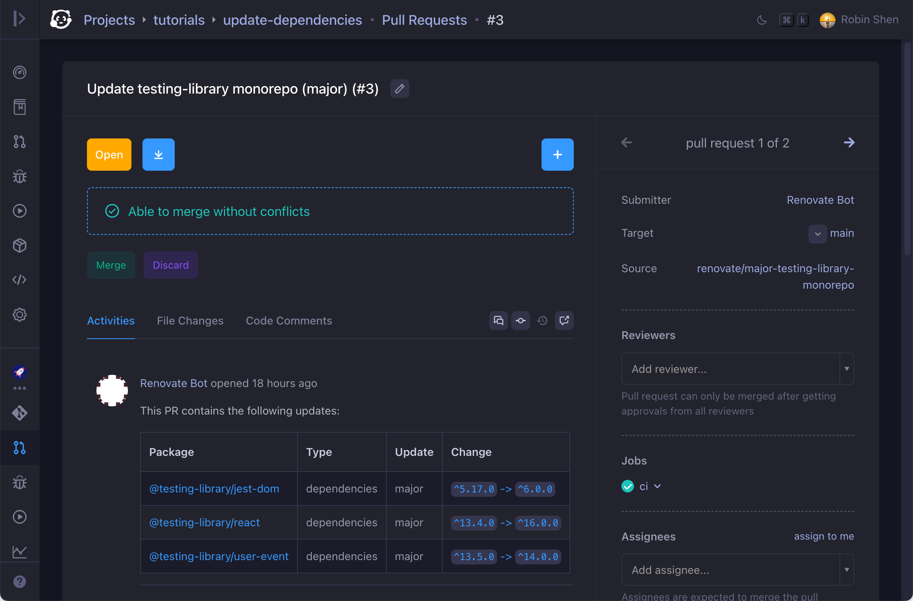

## 🚦 Annotate code with coverage and problems

Code will be annotated with coverage info and problems found in 
CI/CD pipeline, to facilitate code review. 
[**Demo**](https://code.onedev.io/demo/react/~files/6039030814aedeaa6ebac706c0886e3675160666/packages/react-dom/src/client/ReactDOMSelect.js?position=source-202.1-202.36-1)

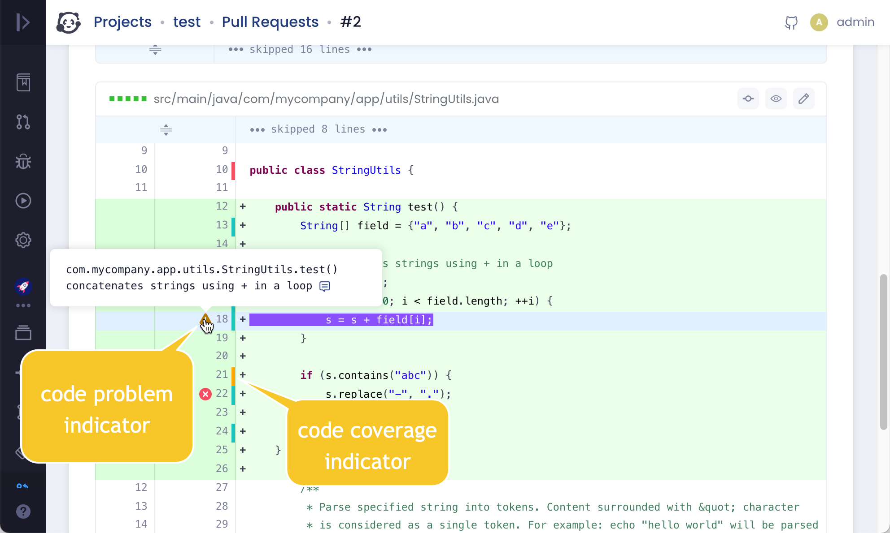

## 💬 Code discussion anywhere anytime

Select any code or diff to start discussion. Suggest and apply changes.
Discussions stay with code to help code understanding.
[**See It In Action**](https://code.onedev.io/onedev/server/~compare?left=160:f96d82a3fa12800b4040cc9ea62af09233307ae9&right=160:e55d152b9cc783fd7e64dc752a6c2b3c5613212c&compare-with-merge-base=false&comment=149&mark=e55d152b9cc783fd7e64dc752a6c2b3c5613212c~server-product/docker/build.sh~22.1-22.148-1&tab=FILE_CHANGES)

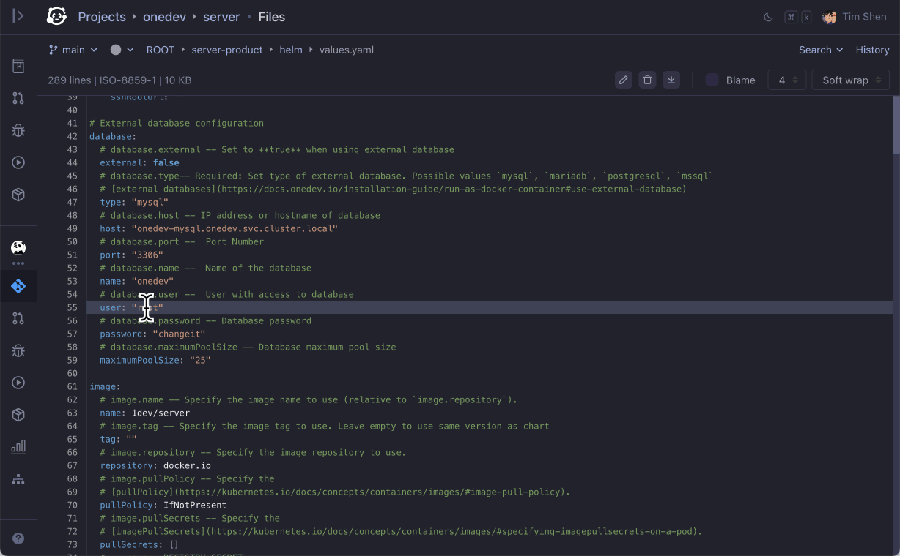

## 🔒 Versatile code protection rules

Set rule to require review or CI/CD verification when certain users touch certain
files in certain branches. 
[**Tutorial**](https://docs.onedev.io/tutorials/code/pullrequest-approval)

## 📋 Automated Kanban to keep team organized

Move tasks manually in Kanban, or define rules to move them automatically
when related work is committed/tested/released/deployed.
[**See It In Action**](https://code.onedev.io/onedev/server/~boards/State?iteration=4.2.0&backlog=true)

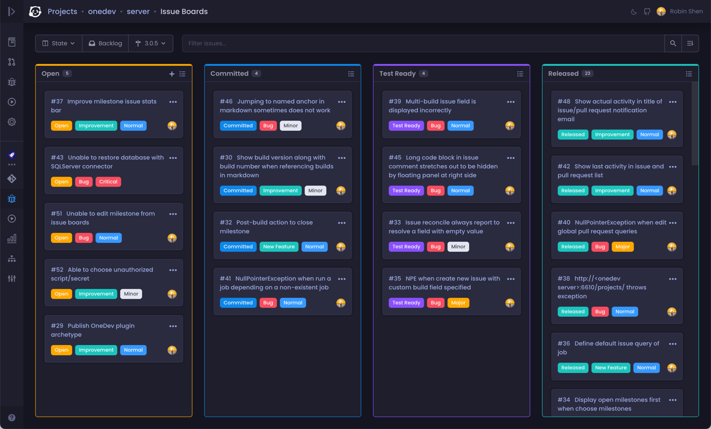

## 🛠 Customizable and flexible issue workflow

Custom issue states and fields. Manual or automatic state transition rules.
Issue links to sync operations and states. Confidential issues in public projects.
[**Tutorial**](https://docs.onedev.io/tutorials/issue/state-auto-transition)

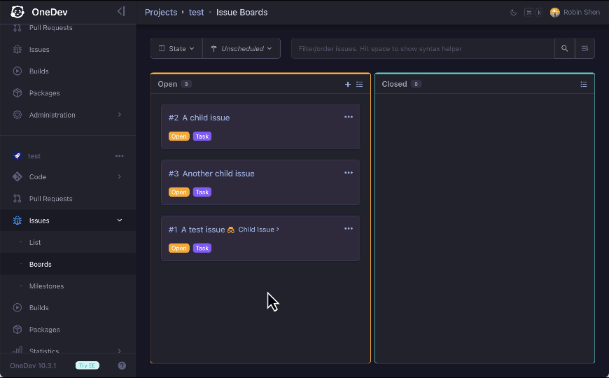

## 📨 Service desk to link emails with issues

Use issues as ticket system to support customers via email, without requiring
them to register accounts. Assign different support contacts for different
projects or customers.
[**Tutorial**](https://docs.onedev.io/tutorials/issue/service-desk)

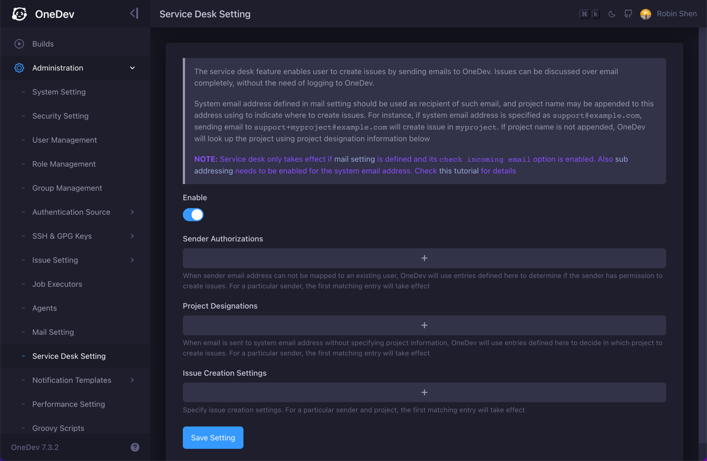

## ⏰ Time tracking and reporting

Track estimated/spent time on tasks. Aggregate time from subtasks automatically.
Generate time sheets for work statistics and billing.
[**Tutorial**](https://docs.onedev.io/tutorials/issue/time-tracking)

## 💡 CI/CD as code without writing code

An intuitive GUI to create CI/CD jobs. Template for typical frameworks.
Typed parameters. Matrix jobs. CI/CD logic reuses. Cache management.
[**Tutorial**](https://docs.onedev.io/category/cicd)

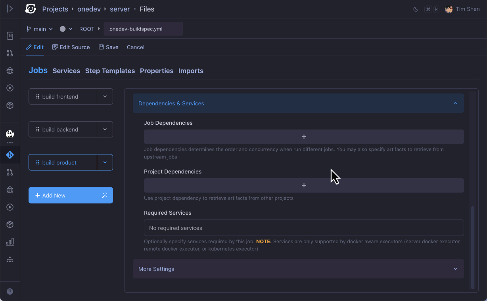

## 🚀 Versatile CI/CD executors from simple to scale

Run CI/CD out-of-box in container or on bare metal. Run massive jobs concurrently
with Kubernetes or agents.
[**Example1**](https://docs.onedev.io/tutorials/cicd/agent-farm)
[**Example2**](https://docs.onedev.io/tutorials/cicd/k8s-farm)

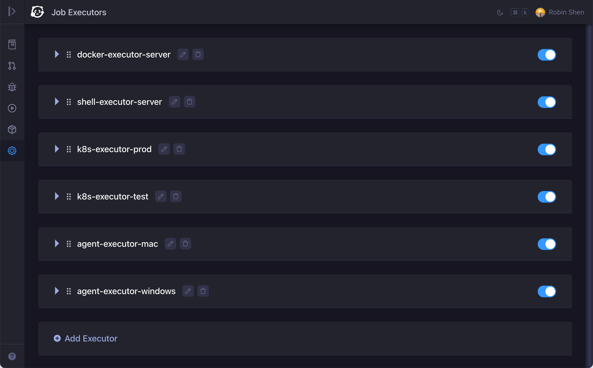

## 🛠 Tools to debug CI/CD jobs

Command to pause job execution. Web terminal to check job execution environment.
Run job locally against uncommitted changes.
[**Tutorial1**](https://docs.onedev.io/tutorials/cicd/diagnose-with-web-terminal)
[**Tutorial2**](https://docs.onedev.io/tutorials/cicd/run-job-against-local-change)

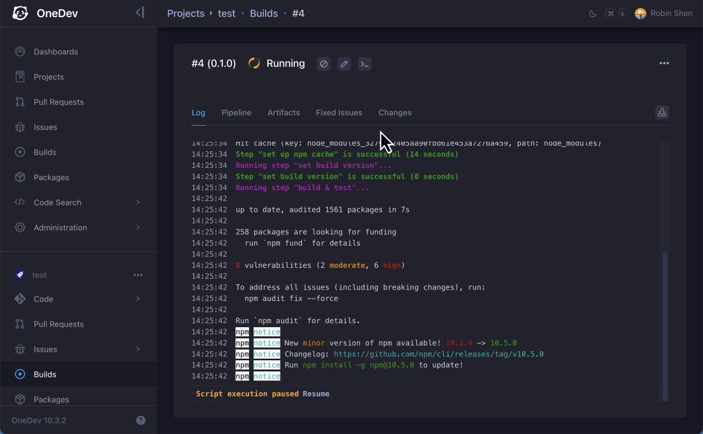

## 📦 Built-in package registries

Built-in registry to manage binary packages. Link packages with
CI/CD jobs.
[**Tutorial**](https://docs.onedev.io/category/packages)

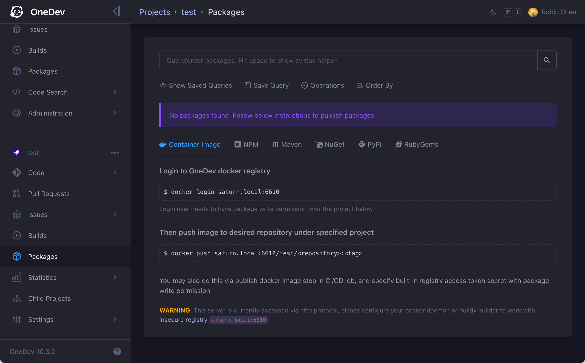

## 🧩 Deep integration and information cross-reference

Transit issue state via commit, CI/CD, or pull request.
Show fixing builds of issue. Query fixed issues or code changes between build/package versions.
[**Example1**](https://code.onedev.io/onedev/server/~builds/4799/fixed-issues?query=%22State%22+is+%22Released%22+order+by+%22Priority%22+desc+and+%22Type%22+asc)
[**Example2**](https://code.onedev.io/onedev/server/~issues/1794/builds)

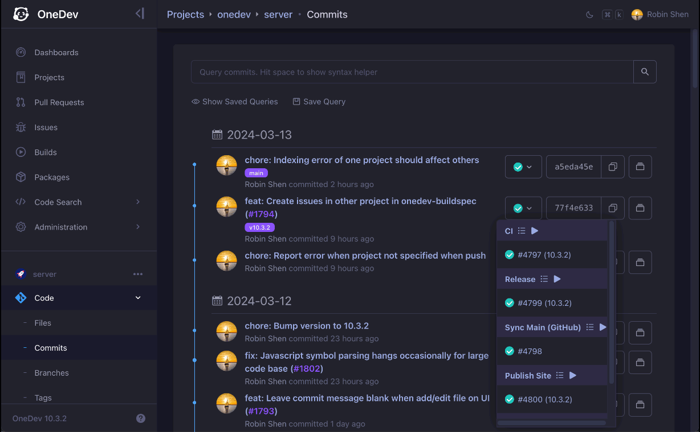

## 🌲 Project tree for easy maintenance

Use tree to organize projects clearly and efficiently.
Define common settings in parent project and inherit in child projects.
[**See It In Action**](https://code.onedev.io/~projects?query=%22Path%22+is+%22onedev%22)

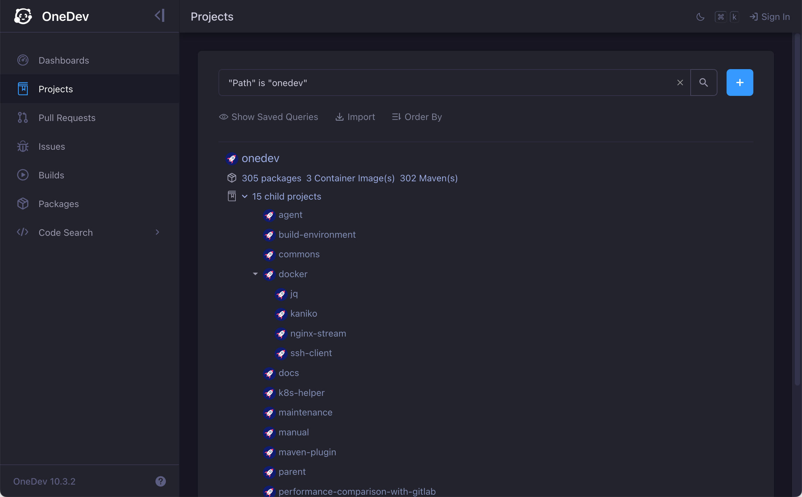

## 🐒 Smart query that can be saved and subscribed

Powerful and intuitive query for everything. Save query for quick access. Subscribe to
query to get notified of interesting events.
[**Try It**](https://code.onedev.io/onedev/server/~issues)

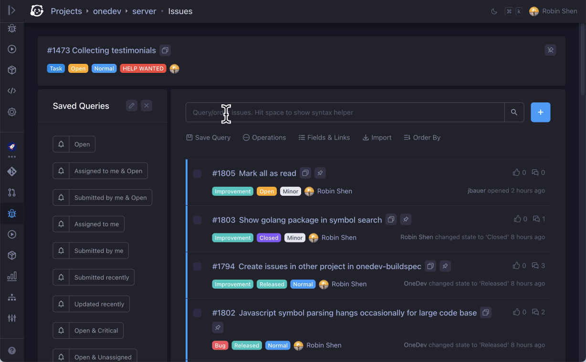

## 🤖 MCP server to interact with OneDev via AI agents

MCP server for managing issues, pull requests, and builds. Streamline DevOps workflows, configure CI/CD jobs, 
and investigate build failures through conversations.
[**Tutorial**](https://docs.onedev.io/tutorials/misc/working-with-mcp)

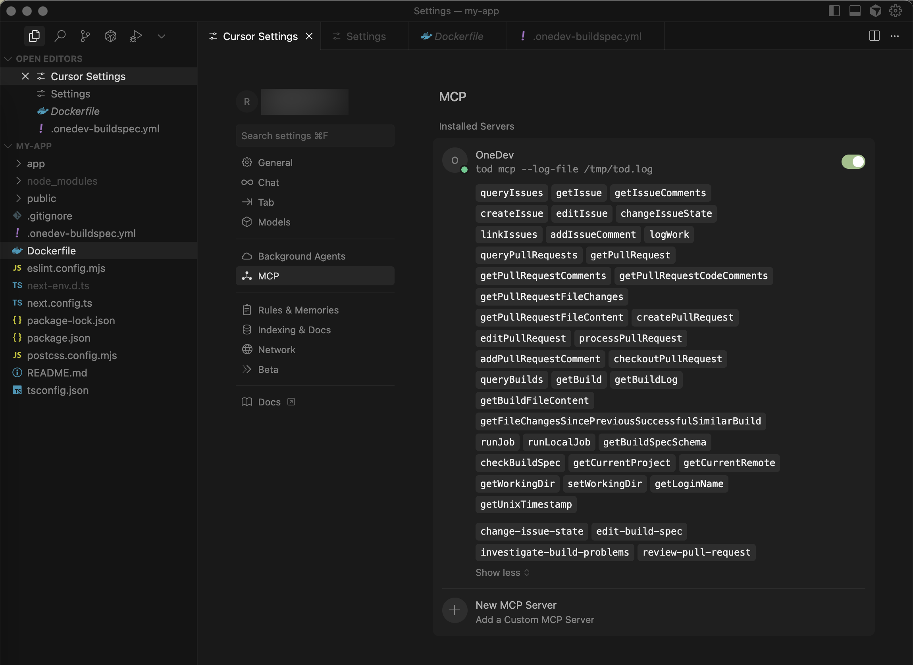

## 🎛️ Dashboard for teams and users

Arrange gadgets in custom dashboard to get important information
at a glance. Share dashboard with users or groups, or make it public
for everyone.
[**See It In Action**](https://code.onedev.io/~dashboards)

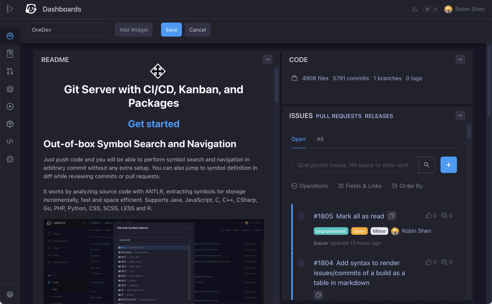

## 👯 Effortless high availability and scalability

Easy cluster setup. Replicate projects across different servers
for high availability, or distribute projects for horizontal scalability.
[**More Info**](https://docs.onedev.io/administration-guide/high-availabilty-scalabilty)

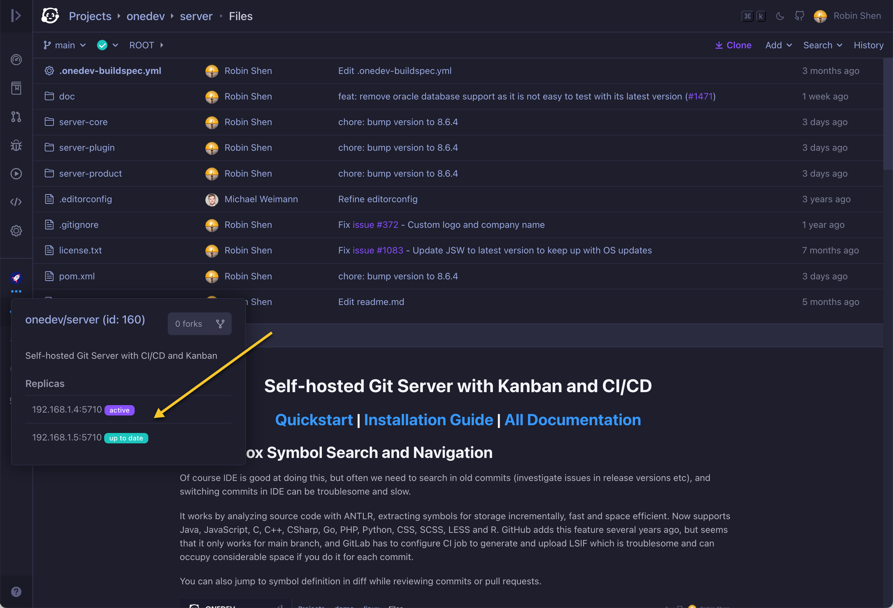

## 🛸 Command palette for quick access

Use cmd/ctrl-k to bring up command palette from anywhere.
Search anything and jump to it without digging through menus.
[**Try It**](https://code.onedev.io)

## 📈 SLOC trend by language

Inspects git history of main branch to calculate trend of
source lines of code by language efficiently.
[**See It In Action**](https://code.onedev.io/onedev/server/~stats/lines)

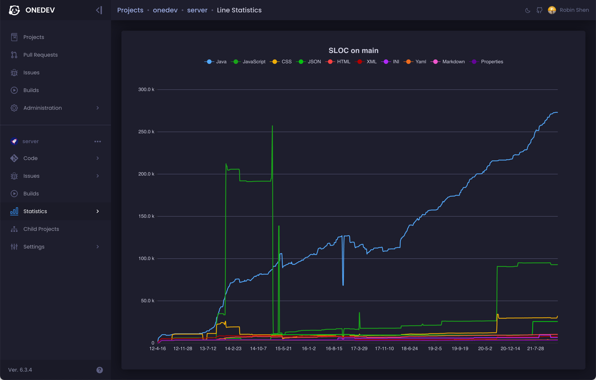

## 🕊️ Fast, lightweight, and reliable

Crafted with resource usage and performance in mind. Get all features above with a 1 core 2G mem box
for medium-sized projects. Intensively used for more than 5 years, with battle-proven reliability.
[**Performance Comparison**](https://faun.pub/performance-compasion-of-onedev-and-gitlab-c11fc27b25be#:~:text=Git%20Push%3A%20OneDev%20is%2040,50%25%20less%20memory%20than%20GitLab)

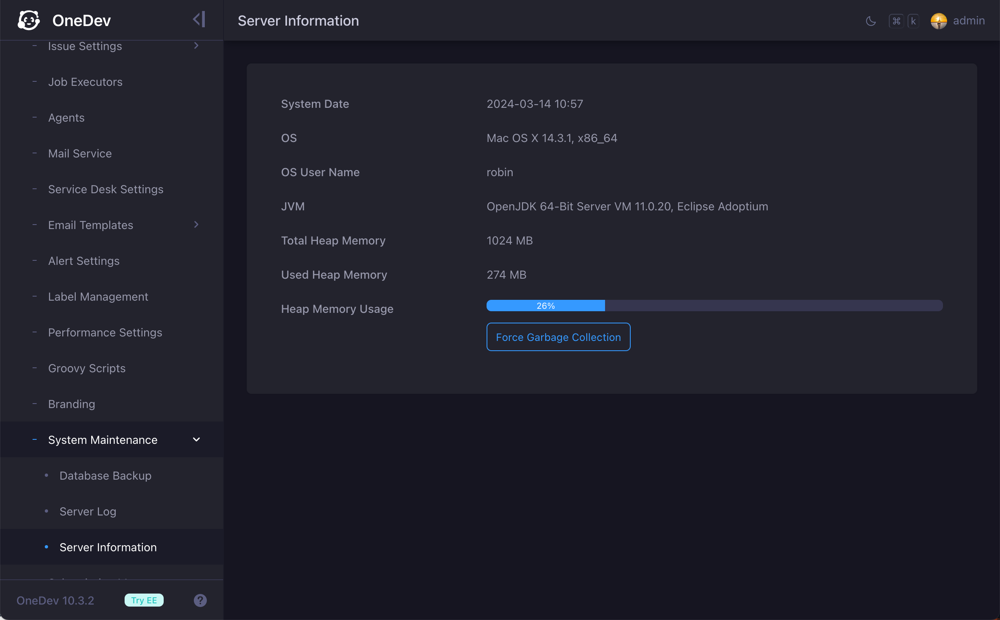
