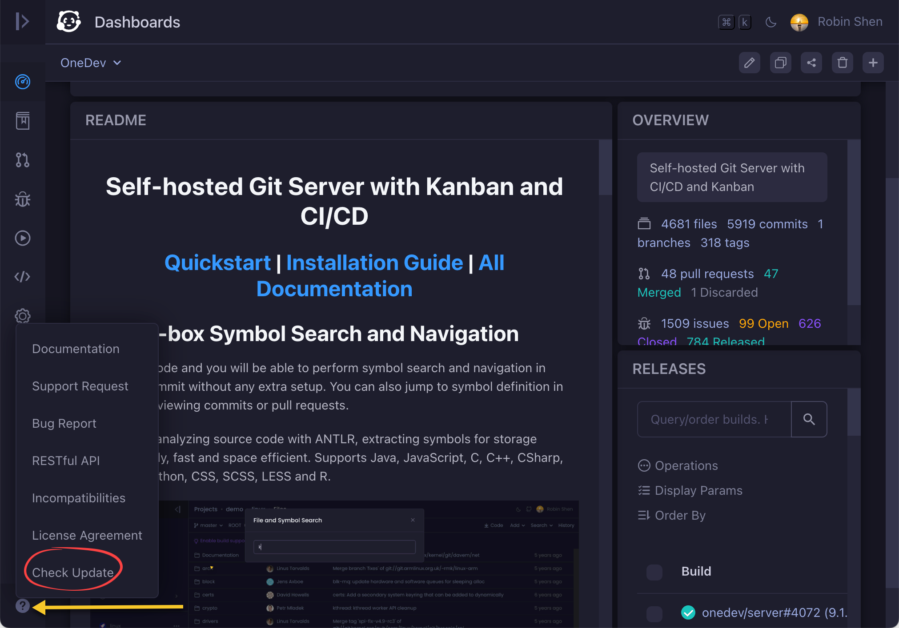

# 9.1.6

Well this is a notice rather than an incompatibility. You are highly recommended to check update
like below to list changes and incompatibilities since your current version before each upgrade 
as some incompatibility change may affect the upgrade procedure:

# 9.1.5

### Agent

Temporal agent support is removed as this feature is flawed (using same token). 
This feature will be replaced by on demand agent launch in future versions

# 9.1.0

### Pull Request

1. The query criteria *has failed builds* has been changed to *has unsuccessful builds*
2. The query criteria *to be verified by builds* has been changed to *has unfinished builds*

# 9.0.0
 
### License Terms

Since 9.0, OneDev introduces [enterprise edition](https://onedev.io/pricing) which requires a paid subscription to use, 
and now it is distributed under [new license](https://onedev.io/license-agreement). In short, the _server-ee_ folder is 
licensed separately with a source available license, while other parts remain MIT licensed. 

It is promised that all existing features prior to 9.0 will never be moved into enterprise edition, and new features 
will be added to MIT licensed part continuously.

### Helm Chart 

1. OneDev only supports to run as statefulsets now. Refer to the [upgrade guide](https://docs.onedev.io/upgrade-guide/deploy-to-k8s) to migrate the persistent volume
2. Various database settings are changed to remove the _db_ prefix. For instance, _.Values.database.dbType_ was changed to _.Values.database.type_. Refer to [values.yaml](https://code.onedev.io/onedev/server/~files/main/server-product/helm/values.yaml) for details

### RESTful api 

The operation to [get issue fields](/~help/api/io.onedev.server.rest.IssueResource/getFields) now return a map of field name to value  

# 8.6.0

### Database 

Oracle support is removed as it is hard to test with latest version. If you happen to use this database, please back up data and restore to a supported database following [this guide]((https://docs.onedev.io/administration-guide/backup-restore)) 

# 8.5.0

### Helm Chart

Helm chart has been completely rewritten to be flexible, and it is not compatible with earlier versions. Follow [upgrade guide](https://docs.onedev.io/upgrade-guide/deploy-to-k8s) to upgrade your chart from version <= 8.4.2

# 8.4.0

### Executor

Kubernetes executor no longer supports to execute step of type `Run Docker Container` to avoid mounting container sock into sidecar container. Put your step logic in a command step instead

# 8.3.4

### Executor 

Kubernetes executor no longer supports to execute build image step even with docker runtime. A kaniko step is added to build image in Kubernetes cluster

### Build Spec 

The `publish` option of `build docker image` step is removed, and now the step always tries to publish the built image

# 8.2.0

Branch/tag protection rules are changed to apply first matching instead of apply all matching

# 8.1.0

**[Agent]** 

A particular agent token can only be used by one agent now. If you have multiple agents using same token, only the first one can connect to server, and others will be rejected. To fix this, open detail page of each rejected agent and copy the newly generated token to agent side

**[RESTful api]** 

1. The endpoint path to list agents in agent token resource has been changed from `/agents` to `/agent`
1. The endpoint to create agent token now do not require any request body. It will generate new token value at OneDev side

# 8.0.7

Various resource update operations now require resource id to be specified in url path instead of request body. Refer to RESTful api help for details   

# 8.0.5

Create tag step and close milestone step in build spec now uses access token to authenticate to server for flexibility and consistence reason. Please edit relevant build specs to specify appropriate access tokens for these two steps, otherwise they will fail 

# 8.0.0

Project site published via public site step in build spec now can be publicly accessible. Previously it is only accessible to users able to access the project 

# 7.9.12

All access tokens of users are re-generated with cryto strong random string. As a result of this, all places using previous access token should be replaced with the new access token. This may include restful api authentication, CI/CD checkout step using access token etc.  

# 7.8.0

To use consistent project url for web and git access, OneDev now uses project path instead of project id to access projects via web UI, for instance `https://code.onedev.io/projects/160` has been changed to `https://code.onedev.io/onedev/server`. To avoid conflicting with this url scheme, 
some service urls have been changed and this causes some incompatibitlities:

1. The RESTful api url now starts with `~api` instead of `api`, for instance url to access project information is now `/~api/projects/{projectId}` 
2. SSO callback url now takes the form `https://<onedev root url>/~sso/callback/<Provider Name>` (use `~sso` instead of `sso`)
3. If you are using OAuth based Office365 or Gmail mail service, make sure to change redirect url as `https://<onedev root url>/~oauth/callback` (use `~oauth` instead of `oauth`)
4. Agents can not upgrade itself for this version, as url connecting to server has been changed. You will need to re-download 
agent package from server if running in bare-metal mode, or re-pull the agent image if running in docker mode
5. If you are setting up reverse proxy using Apache or Nginx, make sure to change proxied path `/server` to `/~server`. Check [the docs](https://docs.onedev.io/administration-guide/reverse-proxy-setup) for details

# 7.7.0

OneDev server and agent now requires Java 11 or higher. Follow below steps to upgrade agent manually:

1. If agent is running as bare metal mode with Java 8, re-download agent package from server and run it 
with Java 11 or higher following the instructions
1. If agent is running as bare metal mode with Java 11 or higher, it will be updated automatically
1. If agent is running in container mode, re-pull the image and start the container

# 7.4.0

### RESTful api

1. A boolean property "confidential" must be added to create endpoint of [issue resource](/~help/api/io.onedev.server.rest.IssueResource/create) to indicate whether or not the issue is confidential

# 7.3.5
1. [RESTful api] Service desk name property of [project resource](/~help/api/io.onedev.server.rest.ProjectResource) moved from basic info endpoint to setting endpoint

# 7.3.0
1. [CI/CD] Docker sock is NOT mounted by default for server docker executor, remote docker executor and Kubernetes 
executor for security reasons. If your CI job performs docker operation, the build may fail. You may enable 
the mount docker sock option in related executors, but make sure to configure authorized jobs of the executor 
to only allow trusted jobs to use the executors

# 7.0.0

1. [RESTful api] Email addresses of a user should now be retrieved via [UserResource.getEmailAddresses](/~help/api/io.onedev.server.rest.UserResource/getEmailAddresses), and should be operated via [EmailAddressResource](/~help/api/io.onedev.server.rest.EmailAddressResource)
2. [RESTful api] Access token of a user should now be retrieved via [UserResource.getAccessToken](/~help/api/io.onedev.server.rest.UserResource/getAccessToken)
3. [RESTful api] User query by login name, full name and email should now be done via [UserResource.queryProfile](/~help/api/io.onedev.server.rest.UserResource/queryProfile)

# 6.2.1

1. [build spec] Registry login setting is removed from build image step (introduced in 6.2.0). Specify registry logins 
in job executor if necessary

# 6.2.0

1. A new property `Run In Container` is added and enabled for all command steps in build spec. If you have steps intended to 
be executed by shell executor, edit them to disable this property, otherwise the build will be failed with error `This step should be executed by server docker executor, remote docker executor, or kubernetes executor`
1. Using cache path &quot;.&quot; (to cache workspace itself) in job cache definition is no longer supported

# 5.4.0 

1. In case install OneDev into a Kubernetes cluster, Kustomization based deployment is replaced by helm based deployment for flexibility reason

# 5.2.1

1. User by default is not able to create/fork projects now. To allow it, specify default login group with appropriate project create permissions in security setting.
2. URL of project is changed from *http(s)://\<onedev-server\>/projects/\<project name\>* to *http(s)://\<onedev-server\>/projects/\<project id\>*. This only affects web UI, clone url and REStful api url is not changed.
3. Job variable *@project_name@* should be replaced by *@project_path@*.
4. Job match condition in job executor is renamed as job requirement, and the criteria to match job name is no longer valid. Executor can now be specified when define the job.

# 4.3.0

1. Service definition is separated from job definition. Previous service defined in job will be moved out of job and take the name _\<job name\>-\<service name\>_ to avoid possible name conflicts. You either need to change it back to use original name in case there is no conflicts, or change your build script to use the new service name. 
2. Job match condition of job executor no longer accepts image criteria. You need to remove it manually if there is any; otherwise the job matching will fail.

# 4.1.3

1. Html report is removed from build spec due to possible XSS vulnerabilities. Check issue #230 for details
2. Setting _Default Fixed Issues Filter_ in build spec has been moved to be under project build setting, in order to facilitate issue query auto-updating upon custom field/state change

# 4.1.0

1. Backslash in job commands should not be escaped now. And literal '@' should be written as '@@'
2. Various query operator _is before_ and _is after_ is substituted with _is until_ and _is since_. For instance issue query _"Submit Date" is before "yesterday"_ should be written as _"Submit Date" is until "yesterday"_

# 4.0.5

1. Renamed build variables:

  |old name|new name|
  |---|---|
  |updated_ref|ref|
  |updated_branch|branch|
  |updated_tag|tag|
  |pull_request_ids|pull_request_number|

1. Removed build variables: _on_branches_, _commit_tags_, 

# 3.2

Version 3.2 uses token authentication instead of password authentication in build spec for security 
consideration. As a result of this, password authentication specified previously will be cleared:

1. Submodule authentication
  
  You will need to use custom http/ssh clone credential with permission to access submodule projects to retrieve source. Refer to [tutorial](https://docs.onedev.io/tutorials/cicd/clone-submodules-ssh/) for an example.
  
2. Project dependency authentication

  You will need to define a job secret containing an access token in project build setting page, and then use that secret in project dependency definition. The access token should have permission to download dependency project artifacts of course.